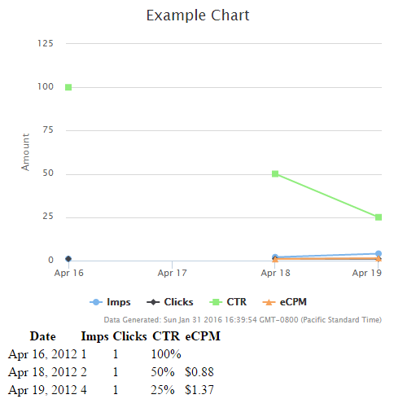

# jquery-highchartsmaker
jQuery plugin to generate highcharts by reading a table

## Usage

### Consider this table

Date | Imps | Clicks | CTR | eCPM
--- | --- | --- | --- | ---
Apr 16, 2012 | 1 | 1 | 100% |  
Apr 18, 2012 | 2 | 1 | 50% | $0.88
Apr 19, 2012 | 4 | 1 | 25% | $1.37

```html
<div id="chart"></div> <!-- You will need to create a target element for where the chart will go -->
<table id="data">
<thead>
    <tr>
        <th>Date</th>
        <th>Imps</th>
        <th>Clicks</th>
        <th>CTR</th>
        <th>eCPM</th>
    </tr>
</thead>
<tbody>
    <tr>
        <td>Apr 16, 2012</td>
        <td>1</td>
        <td>1</td>
        <td>100%</td>
        <td></td>
    </tr>
    <tr>
        <td>Apr 18, 2012</td>
        <td>2</td>
        <td>1</td>
        <td>50%</td>
        <td>$0.88</td>
    </tr>
    <tr>
        <td>Apr 19, 2012</td>
        <td>4</td>
        <td>1</td>
        <td>25%</td>
        <td>$1.37</td>
    </tr>
</tbody>
</table>
```

### Call highchartsmaker plugin on the target element (in this case, the element ID 'chart')
```javascript
$('#chart').highchartsMaker($(#data), {
    // Options (or pass empty object for no special options)
    "yAxis":{
        "min":0
    },
    "date_interval":86400000,
    "title":"Example Chart"
});
```

### Result


## Dependencies
* [jQuery](https://jquery.com/)
* [Highcharts](http://www.highcharts.com/)
